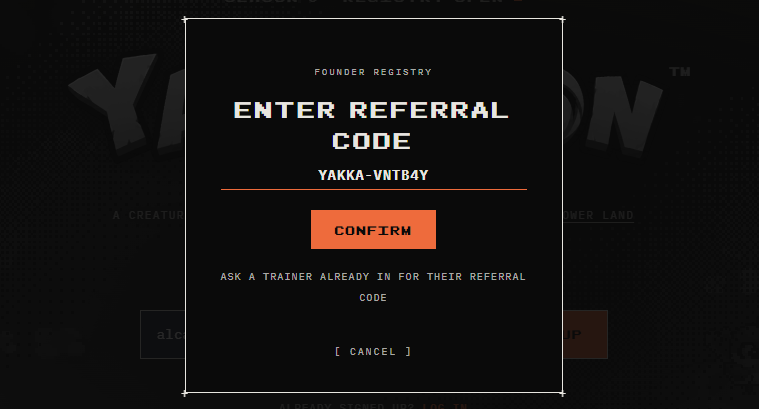
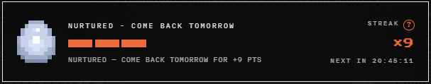
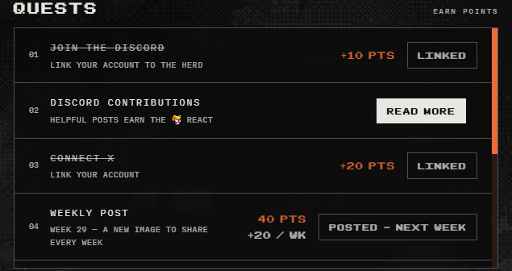
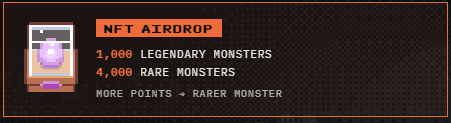

import ResourceCard from "@components/guias/ResourceCard.astro"
import GuideSummary from "@components/guias/GuideSummary.astro"
import GuideStep from "@components/guias/GuideStep.astro"

<GuideSummary>
  <GuideStep step="1" text="Pre-registration - Code: YAKKA-VNTB4Y">
    <a
      href="https://yakkamon.com?code=YAKKA-VNTB4Y"
      target="_blank"
      class="flex items-center gap-2.5 px-3 py-2 rounded-xl bg-gradient-to-r from-blue-500/10 to-indigo-500/10 border border-blue-500/40 text-blue-400 font-medium text-xs hover:from-blue-500/20 hover:to-indigo-500/20 hover:border-blue-400 hover:text-blue-300 transition-all no-underline shadow-[0_0_15px_rgba(59,130,246,0.2)] group hover:scale-105 active:scale-95"
    >
      Go to Yakkamon
    </a>
  </GuideStep>
  <GuideStep step="2" text="Daily Routine (The Grind)">
    

      3 Taps & Socials
    

  </GuideStep>
  <GuideStep step="3" text="Missions ($FLOWER)">
    

      Deposit (Multiplier)
    

  </GuideStep>
  <GuideStep step="4" text="Free Mint (Oct 1st)">
    

      Monster NFT
    

  </GuideStep>
</GuideSummary>

## Official Channels (⚠️ Important)

- **Site:** [yakkamon.com](https://yakkamon.com)
- **Docs:** [docs.yakkamon.com](https://docs.yakkamon.com)
- **X:** [@yakkamon_game](https://x.com/yakkamon_game) *(the previous @playyakkamon was compromised/hacked; do not trust it)*

> ⚠️ **Warning:** They will never ask for your seed phrase or private key. Only email is required for initial registration.

There are currently **~54,000 registered trainers** (out of a 100,000 goal for early access).

---

## Step 1: Registration (Your entry ticket)

Register on <a href="https://yakkamon.com?code=YAKKA-VNTB4Y" target="_blank" rel="noopener noreferrer" class="text-blue-500 hover:underline">yakkamon.com</a> with your email + invite code: **YAKKA-VNTB4Y**.

By registering, you receive a **Monster Egg** (in-game item, not an NFT). It will automatically appear on your farm the first day you log in. The egg's *tier* depends on your registration order:

- **Platinum** → first 10,000
- **Gold** → 10,001–25,000
- **Silver** → 25,001–50,000
- **Bronze** → 50,001–100,000
- **Basic** → 100,001+

> 💡 **Note:** The egg's tier does not give you early access or ranking. It only affects the initial egg. **The real ranking is earned with points.**

## Step 2: Daily and Weekly Routine (The grind that matters most)

Consistency beats early registration. Do this routinely; it's the most sustainable base.

### Daily tasks
- **Pamper the egg every day:** 3 daily taps = +6 points. There is a streak bonus.

### Connect socials (One-time)
- **Discord:** +10 pts
- **X (Twitter):** +10 pts
- **Wallet:** +10 pts (when enabled). We recommend using <ResourceCard id="rabby" label="Rabby Wallet" /> or <ResourceCard id="ronin" label="Ronin Wallet" />.

### Community Activity
- **Share the weekly X post:** +20 pts/week
- **Valuable posts on Discord:** Getting a special mod reaction = +5 pts per post (max. ~25 pts)

## Step 3: Heavyweight Missions (Referrals + $FLOWER Deposits)

This is where top ranks separate.

### Referrals
Each friend with your code = **+30 points**.
- First 5 friends: instant points.
- From the 6th onwards: the friend must verify Discord + X and reach 100 points themselves for you to receive the points.

> 🛑 **Important:** Very strict anti-bot system. Duplicate/fake accounts lead to point deductions and possible disqualification. Only use real friends.

### $FLOWER Deposits (🔥 Updated – Urgent)

You can deposit on **Base** or **Ronin** (low minimum, usually from 5 $FLOWER). 
**1 Base $FLOWER = 1 point** + volume bonuses (exponential).

**Current Promo (Opening Week): 3X points for $FLOWER.**
Approximate examples with the current 3X:
- **50 $FLOWER** → ~150 pts
- **500 $FLOWER** → ~1,500 pts
- **5,000 $FLOWER** → ~15,000 pts
- **50,000 $FLOWER** → ~150,000 pts
*(Volume bonuses are applied on top of the multiplier).*

The multiplier progressively decreases (it will drop to 2.8x next week and continue dropping 0.2x per week until it reaches 1x).

> 💎 **Key Advantage:** No lock-up. You keep ownership of the tokens and will be able to withdraw them tax-free or spend them in-game when you get access. *(There may be temporary withdrawal limits at launch for security).*

Deposits have just been activated and are in the opening window. **This is the moment with the highest points ROI.**

## Step 4: Free Mint – October 1st

There will be a limited collection of **10,000 Monster NFTs on Ronin**, for free (you only pay Ronin gas).

- Only for registered and verified trainers (whitelist).
- 1 mint per trainer. The contract blocks bots.
- Gives you **+250 direct points**.
- Within the 10,000, there are **5 hidden Legendaries**.
- It is a blind mint (revealed at the start of early access).

> 💡 **Note:** The registration Monster Egg is different; this mint is an actual, separate NFT.

## The Outcome (Q4 2026)

When Season 0 closes, rewards will be distributed based on your ranking:

**Early Access (Only the top 100,000 by points):**
- 1–1,000 → Wave 1 (with Legendary Egg variants)
- 1,001–5,000 → Wave 2
- 5,001–20,000 → Wave 3
- 20,001–100,000 → Wave 4

**NFT Airdrop:**
- **Top 5,000** → Monster NFT airdrop
- **Top 1,000** → Legendary Monster NFT

*There will be a live reveal event when early access opens (free mint + airdrop open together).*

---

## 🎯 Optimized Strategy Summary

1. Register now if you haven't (even if it's a Basic egg).
2. Connect Discord + X immediately.
3. **Top priority right now:** deposit $FLOWER while the opening week's 3X multiplier lasts.
4. Maintain the daily routine of 3 taps + real referrals + weekly activity.
5. Prepare for the October 1st free mint (verification ready).

*(Remember: Ranking = points. Early registration only improves your initial egg).*
