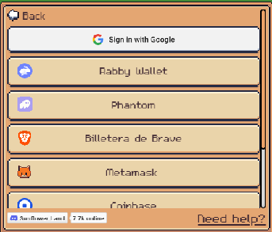
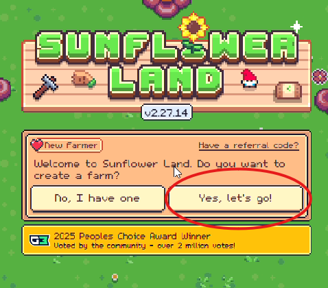
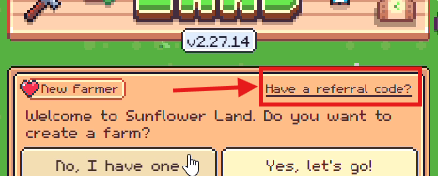
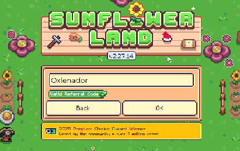
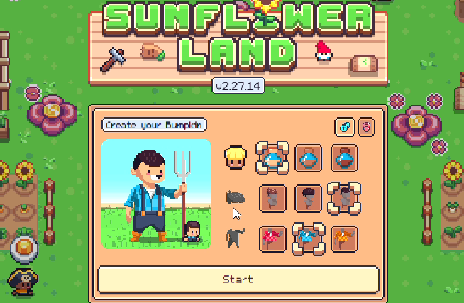
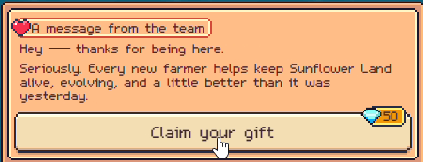
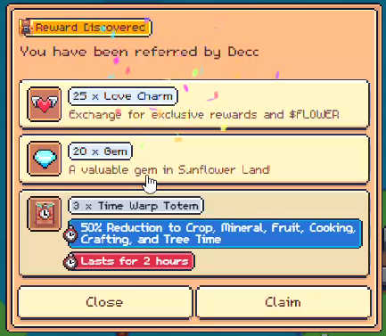
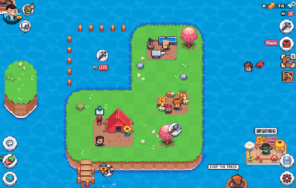

import ResourceCard from "@components/guias/ResourceCard.astro"
import GuideSummary from "@components/guias/GuideSummary.astro"
import GuideStep from "@components/guias/GuideStep.astro"

<GuideSummary>
  <GuideStep step="1" text="Crear tu cuenta">
    <a
      href="https://sunflower-land.com/play/?ref=Oxlenador"
      target="_blank"
      class="flex items-center gap-2.5 px-3 py-2 rounded-xl bg-gradient-to-r from-emerald-500/10 to-green-500/10 border border-emerald-500/40 text-emerald-400 font-medium text-xs hover:from-emerald-500/20 hover:to-green-500/20 hover:border-emerald-400 hover:text-emerald-300 transition-all no-underline shadow-[0_0_15px_rgba(16,185,129,0.2)] group hover:scale-105 active:scale-95"
    >
      Ir a Sunflower Land
    </a>
  </GuideStep>
  <GuideStep step="2" text="Código: Oxlenador">
    

      Recompensas Extra
    

  </GuideStep>
  <GuideStep step="3" text="Conoce las mecánicas">
    

      Cultivar, Minar & Craftear
    

  </GuideStep>
</GuideSummary>

## Introducción a Sunflower Land

Sunflower Land es un juego de granja que combina eventos interactivos, una gran comunidad y mecánicas muy divertidas. Pero aquí viene lo interesante: te invita a "poner toda la carne en el asador", ya que está respaldado por una economía real y, sobre todo, mucho amor por el juego.

Si quieres adentrarte en este mundo, aquí te explico cómo empezar paso a paso.

---

## Paso 1: Crear tu cuenta

Primero, dirígete al sitio web oficial y crea una cuenta nueva usando el enlace del resumen superior o <a href="https://sunflower-land.com/play/?ref=Oxlenador" target="_blank" rel="noopener noreferrer" class="text-emerald-500 hover:underline">haz clic aquí</a>.

A continuación, deberás elegir cómo iniciar sesión. Te recomiendo utilizar una wallet que soporte la red de Polygon (<ResourceCard id="rabby" label="Rabby Wallet" /> es una excelente opción). Sin embargo, si no estás familiarizado con las wallets o prefieres algo más sencillo, puedes iniciar sesión directamente con tu cuenta de Google.

Una vez elijas tu método, deberás firmar la conexión. Esto creará una "granja NFT" que quedará vinculada a tu wallet. Si optaste por iniciar con Google, el sistema generará automáticamente una wallet interna muy fácil de manejar, pensada para ofrecerte la mejor experiencia de usuario (UX).

Te aparecerá un mensaje pidiéndote confirmación para crear una granja nueva. Si por casualidad ya tienes una "land" (tierra) en tu billetera, selecciona *“No, I have one”*. Pero como es tu primera vez, haz clic en **“Yes, let’s go!”**.

### Recompensas de Referido

Si tienes un código de referido, ¡úsalo! Te regalarán un paquete de bienvenida. Si no tienes uno, siéntete libre de usar el mío: **Oxlenador** (la primera letra es una "O" de oso en mayúscula).

Finalmente, elige el diseño inicial de tu Bumpkin (tu avatar) y haz clic en **Start**.

---

## Paso 2: Recibir recompensas de bienvenida

Al entrar, es probable que recibas un regalo de bienvenida, como unas 50 gemas (valoradas en promedio en unos 5 tokens de FLOWER).

Además, por haber utilizado el código de referido, recibirás este otro paquete de recompensas extra.

Aquí te explico para qué sirve cada cosa:
- **Love Charms:** Son puntos de amor que obtienes al interactuar socialmente en el juego. Cada uno equivale aproximadamente a 0.012 FLOWER.
- **Gemas:** Funcionan como créditos dentro del juego. Se utilizan para ciertas mecánicas especiales, como resetear el mercado de semillas, comprar herramientas y más.
- **Time Warp Totem:** Es un potenciador temporal. Durante 2 horas, duplicará la velocidad de producción de tus cultivos, minerales, frutas, cocina y árboles.

> 💡 **Tip Estratégico:** Hay muchísimas estrategias, pero mi consejo para empezar es que vendas los *Love Charms* a cambio de FLOWER en la "Isla del Amor" (disponible cada 7 horas en la plaza principal). Guarda tus **Gemas** exclusivamente para resetear el mercado de semillas y herramientas, ya que no hay otra forma de hacerlo y te harán mucha falta. En cuanto al **Tótem**, consérvalo para más adelante, cuando tu granja sea más grande o haya algún evento especial de producción.

---

## Paso 3: Introducción a las mecánicas básicas

En Sunflower Land, tu granja inicial está ubicada en una isla pequeña, dividida por expansiones de terreno de 36 espacios (slots). La mecánica principal del juego consiste en realizar las siguientes acciones para ir creciendo:

- Cultivar.
- Cortar madera.
- Minar.
- Craftear (crear objetos).
- Comerciar.

Para desbloquear nuevos terrenos, necesitarás gastar recursos. Estos recursos los consigues recolectando en los diferentes nodos de tu isla: árboles (madera), rocas (piedra), vetas de hierro, etc. A medida que expandas tu tierra, irás descubriendo más nodos que aumentarán tu producción. 

Luego, podrás utilizar esos recursos para craftear materiales más avanzados o comerciarlos por monedas (coins) y FLOWER en los distintos mercados del juego, como el mercado de Betty, el comercio P2P (entre jugadores) y las entregas (deliverys) que podrás hacer a diferentes NPCs repartidos por el mapa.

---

## Siguientes pasos

¡Felicidades! Ya tienes tu granja y entiendes lo básico. El siguiente paso es empezar a optimizar tus cultivos y subir de nivel a tu Bumpkin para desbloquear nuevas zonas y recetas.
